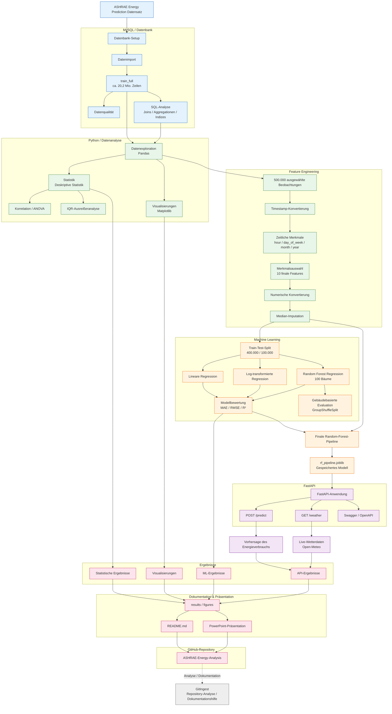

# 🏢 ASHRAE Energy Analysis

**End-to-End Data-Analytics-Projekt** zur Analyse des Energieverbrauchs von Gebäuden – von der relationalen Datenbank über explorative & statistische Analyse bis hin zu Machine Learning und einer produktiven API.


```text
SQL / MySQL → Python → Statistik → Feature Engineering → Machine Learning → API
```

---

## 👀 Auf einen Blick

* **Was:** Analyse und Vorhersage des Stromverbrauchs von Gebäuden auf Basis des ASHRAE-Datensatzes
* **Umfang:** über 20 Mio. Zeilen in MySQL, 500.000 Messungen für die Analyse und das Machine Learning
* **Methoden:** SQL, EDA, Korrelation, ANOVA, Ausreißeranalyse, lineare Regression, Random Forest
* **Ergebnis:** Random Forest mit R² = **0,9846** auf 100.000 Testdaten (bekannte Gebäude) und R² = **0,1945** auf unbekannten Gebäuden
* **Bereitstellung:** FastAPI mit den Endpoints `/predict` und `/weather` sowie Swagger-Dokumentation
* **Code & Doku:** vollständiger Workflow auf GitHub, inklusive Präsentation

---

## 🎯 Forschungsfrage

> Wie unterscheidet sich der Energieverbrauch nach Gebäudetyp, Zählertyp und Standort, und welche Zusammenhänge bestehen mit Gebäude- und Wetterinformationen?

---

## ✨ Projekt-Highlights

| Kennzahl             | Ergebnis                                                                                  |
| -------------------- | ----------------------------------------------------------------------------------------- |
| 📊 Datenbasis        | > 20 Mio. Zeilen in `train_full`, davon 500.000 Messungen für das ML-Modell               |
| 🧹 Datenvorbereitung | 500.000 Beobachtungen beibehalten, fehlende Feature-Werte per Median-Imputation behandelt |
| 🤖 Random Forest     | R² = **0,9846**, MAE = **16,12**, RMSE = **48,62**                                        |
| 🌳 Modell            | RandomForestRegressor mit 100 Bäumen                                                      |
| 🚀 Deployment        | FastAPI-Anwendung mit Swagger/OpenAPI                                                     |
| 🔌 API-Test          | `/predict` erfolgreich mit **440,6812** getestet                                          |

Das finale Random-Forest-Modell wird für die Vorhersage des Energieverbrauchs verwendet und anschließend über eine FastAPI-Anwendung bereitgestellt.

---

## 🧠 Gezeigte Kompetenzen

| Bereich          | Umsetzung im Projekt                                                       |
| ---------------- | -------------------------------------------------------------------------- |
| Datenbanken      | MySQL-Aufbau, Import, Datenqualitätsprüfung, Joins, Indizes                |
| Datenanalyse     | EDA mit Python und Pandas, Visualisierung mit Matplotlib                   |
| Statistik        | Deskriptive Statistik, Korrelation, ANOVA, IQR-Ausreißeranalyse            |
| Machine Learning | Feature Engineering, lineare Regression, Log-Transformation, Random Forest |
| Modellbewertung  | MAE, RMSE, R², Train-Test-Split, kritische Einordnung der Ergebnisse       |
| Deployment       | FastAPI, Swagger/OpenAPI, Joblib-Pipeline, Anbindung der Open-Meteo-API    |
| Dokumentation    | Strukturiertes GitHub-Repository, README, Präsentation                     |

---

## 🧩 Projektziele

* Aufbau und Verwaltung einer relationalen Datenbank (MySQL)
* Integration von Energie-, Gebäude- und Wetterdaten
* Prüfung der Datenqualität
* Explorative Datenanalyse (EDA)
* Statistische Untersuchung des Energieverbrauchs (Korrelation, ANOVA, Ausreißeranalyse)
* Visualisierung zentraler Ergebnisse
* Feature Engineering für das Machine Learning
* Entwicklung und Bewertung mehrerer ML-Modelle
* Bereitstellung einer API für Vorhersage und Live-Wetterdaten
* Dokumentation und Präsentation des Gesamtprojekts

---

## 🗂️ Daten

Verwendet wird der **ASHRAE Energy Prediction Datensatz** mit Energie-, Gebäude- und Wetterinformationen.

**Zentrale Tabellen:** `train`, `building_metadata`, `weather_train`, `train_full`

**Verknüpfungsschlüssel:** `building_id`, `site_id`, `timestamp`

Der konsolidierte Datensatz `train_full` verbindet Energieverbrauch, Gebäudeinformationen und Wetterdaten.

> ℹ️ Die originalen ASHRAE-Rohdaten werden aufgrund ihrer Dateigröße nicht im Repository gespeichert. Alle SQL-Skripte für Import, Aufbereitung und Analyse sind jedoch vollständig dokumentiert.

---

## 🔄 Workflow

Das Projekt folgt einem vollständigen End-to-End-Workflow: vom originalen ASHRAE-Datensatz über Datenanalyse und Machine Learning bis zur API-Bereitstellung und Dokumentation.



### Überblick über den Workflow

1. **Daten & MySQL** – Import und Strukturierung der ASHRAE-Daten, Erstellung von `train_full`, Datenqualitätsprüfungen, SQL-Analysen, Joins, Aggregationen und Indizes.
2. **Python & Statistik** – Datenexploration mit Pandas, deskriptive Statistik, Korrelationsanalyse, ANOVA, Ausreißeranalyse und Visualisierungen.
3. **Feature Engineering** – Auswahl von 500.000 Beobachtungen, Ableitung zeitlicher Merkmale aus dem Timestamp, Auswahl der 10 finalen Features, numerische Konvertierung und Behandlung fehlender Werte per Median-Imputation.
4. **Machine Learning** – Training und Vergleich von linearer Regression, log-transformierter linearer Regression und Random Forest. Bewertung mit MAE, RMSE und R², einschließlich einer gebäudebasierten Evaluation mit `GroupShuffleSplit`.
5. **API** – Speichern der finalen Random-Forest-Pipeline und Einbindung in FastAPI mit den Endpoints `/predict` und `/weather`, dokumentiert über Swagger/OpenAPI.
6. **Ergebnisse & Dokumentation** – Zusammenführung der statistischen, visuellen, ML- und API-Ergebnisse im Ordner `results/figures`, im README und in der PowerPoint-Präsentation.
7. **GitHub & GitIngest** – Veröffentlichung auf GitHub. GitIngest dient nur als ergänzendes Werkzeug zur Repository-Analyse und Dokumentation und ist nicht Teil der Ausführungs-Pipeline.

---

## 🗄️ SQL / MySQL

Grundlage der Datenverarbeitung: Datenbank- und Tabellenaufbau, Import der Rohdaten, Qualitäts- und Schlüsselprüfung, Verknüpfung der Tabellen sowie erste Analysen.

```text
01_SQL_MySQL/

├── 01_database_setup.sql
├── 02_data_import.sql
├── 03_data_quality.sql
├── 04_train_full.sql
├── 05_analysis.sql
├── 06_indexes.sql
├── joins.sql
└── README.md
```

### Optimierung der Abfragen

Es wurden Indizes auf zentralen Verknüpfungs- und Analysefeldern angelegt, um die Performance der SQL-Abfragen zu verbessern.

Dazu gehören unter anderem `building_id`, `timestamp`, `(site_id, timestamp)` und `primary_use`.

<details>
<summary>📋 Übersicht der Indizes anzeigen</summary>

```text
+-------------------+----------------------------+-------------+
| TABLE_NAME        | INDEX_NAME                 | COLUMN_NAME |
+-------------------+----------------------------+-------------+
| building_metadata | idx_building_id            | building_id |
| train             | idx_train_building         | building_id |
| train             | idx_train_timestamp        | timestamp   |
| weather_train     | idx_weather_site_time      | site_id     |
| weather_train     | idx_weather_site_time      | timestamp   |
| train_full        | idx_train_full_primary_use | primary_use |
+-------------------+----------------------------+-------------+
```

</details>

Für die Analyse nach `primary_use` wurde ein B-Tree-Index erstellt:

```sql
CREATE INDEX idx_train_full_primary_use
ON ashrae_energy.train_full (primary_use);
```

Mit `EXPLAIN` wurde bestätigt, dass MySQL diesen Index für die `GROUP BY primary_use`-Abfrage verwendet:

```text
Index scan on train_full using idx_train_full_primary_use
```

Bei einem gemessenen Testlauf reduzierte sich die Ausführungszeit von **24:40 Minuten auf 19:53 Minuten**, entsprechend einer beobachteten Verbesserung von **ca. 19,4 %**.

> **Hinweis:** Die Messung basiert auf einem einzelnen Testlauf. Für eine belastbare Performance-Bewertung sind mehrere kontrollierte Testläufe erforderlich.

### Datenqualität und Verteilung des Verbrauchs

Die SQL-Analyse wurde auf der konsolidierten Tabelle `train_full` durchgeführt, die Energieverbrauch, Gebäude- und Wetterinformationen enthält.

#### Datenqualität

| Kennzahl                           |                 Ergebnis |
| ---------------------------------- | -----------------------: |
| Messungen gesamt                   |               20.216.100 |
| Verschiedene Gebäude               |                    1.449 |
| `meter_reading` mit NULL           |                        0 |
| Negative `meter_reading`-Werte     |                        0 |
| `meter_reading` gleich null        |    1.873.976 (9,27 %)    |
| Positive `meter_reading`-Werte     |   18.342.124 (90,73 %)   |

Es wurden keine fehlenden oder negativen Werte in `meter_reading` festgestellt. Nullwerte machen 9,27 % aller Messungen aus.

#### Nullwerte nach Zähler

| Zähler |  Messungen | Nullwerte | Anteil Nullwerte |
| -----: | ---------: | --------: | ---------------: |
|      0 | 12.060.910 |   530.169 |           4,40 % |
|      1 |  4.182.440 |   656.504 |          15,70 % |
|      2 |  2.708.713 |   346.960 |          12,81 % |
|      3 |  1.264.037 |   340.343 |          26,93 % |

Der Anteil der Nullwerte unterscheidet sich deutlich zwischen den vier Zählertypen.

#### Durchschnittlicher Verbrauch nach Gebäudenutzung

Für jede `primary_use`-Kategorie wurde der Durchschnitt von `meter_reading` berechnet.

| Gebäudenutzung                | Durchschnitt `meter_reading` |
| ----------------------------- | ---------------------------: |
| Education                     |                     4.585,09 |
| Services                      |                     4.113,47 |
| Healthcare                    |                       738,60 |
| Office                        |                       526,50 |
| Utility                       |                       512,74 |
| Entertainment/public assembly |                       473,88 |
| Food sales and service        |                       304,91 |
| Public services               |                       288,24 |
| Manufacturing/industrial      |                       285,90 |
| Lodging/residential           |                       279,71 |
| Parking                       |                       169,39 |
| Retail                        |                       139,78 |
| Other                         |                       138,70 |
| Technology/science            |                       138,20 |
| Warehouse/storage             |                        54,36 |
| Religious worship             |                         5,38 |

Diese Werte sind Durchschnitte einzelner Messungen, gruppiert nach `primary_use`. Sie dürfen nicht als durchschnittlicher Gesamtverbrauch pro Gebäude interpretiert werden.

### Zeitliche Analyse – Gebäude 1017

Für das Gebäude `1017` wurde im Jahr 2016 ein Vergleich der Zähler `1` und `3` durchgeführt.

| Monat     |     Zähler 1 |     Zähler 3 |
| --------- | -----------: | -----------: |
| Januar    |         0,00 |   955.325,16 |
| Februar   |         0,00 |   604.255,30 |
| März      |       879,16 |   346.417,75 |
| April     |    25.409,27 |    89.214,69 |
| Mai       |    38.157,70 |       140,89 |
| Juni      |    99.322,18 |         4,78 |
| Juli      |   144.132,27 |        20,30 |
| August    |   136.423,92 |        44,18 |
| September |    68.931,05 |    15.193,65 |
| Oktober   |    37.425,42 |   118.803,04 |
| November  |    26.468,86 |   309.904,45 |
| Dezember  |         0,00 |   191.313,91 |

Die beiden Zähler zeigen unterschiedliche zeitliche Verbrauchsmuster. Zähler 1 erreicht seinen höchsten Monatswert im Juli, Zähler 3 seine höchsten Werte am Jahresanfang und Jahresende. Die genaue Funktion der Zähler wurde nicht bestätigt, daher lassen sich die Ursachen dieser Unterschiede allein aus dieser Analyse nicht bestimmen.

### SQL-Performance und Indizierung

Für die Performance-Bewertung der gruppierten Analyse wurde ein Index auf `primary_use` erstellt.

| Test                | Ausführungszeit   |
| ------------------- | ----------------: |
| Vor dem Index       | 24 min 40,268 s   |
| Nach dem Index      | 19 min 52,955 s   |
| Beobachtete Differenz | 19,4 %          |

Die getestete Abfrage war nach dem Anlegen des Index etwa 19,4 % schneller. Dieses Ergebnis ist ein beobachteter Vergleich für die getestete Abfrage; für eine belastbarere Performance-Bewertung wären wiederholte, kontrollierte Messungen erforderlich.

### Wichtigste SQL-Ergebnisse

1. Es wurden keine `NULL`- oder negativen `meter_reading`-Werte festgestellt.
2. Verbrauch gleich null macht **9,27 %** aller Messungen aus und variiert je nach Zählertyp.
3. Der durchschnittliche `meter_reading` unterscheidet sich deutlich zwischen den `primary_use`-Kategorien.
4. Gebäude 1017 zeigt unterschiedliche zeitliche Muster zwischen den Zählern 1 und 3.
5. Der getestete Index auf `primary_use` verringerte die beobachtete Ausführungszeit um **19,4 %**.

---

## 🐍 Python

Datenexploration, Datenaufbereitung, statistische Auswertung, Visualisierung und Vorbereitung der ML-Daten.

```text
02_Python/

├── data_exploration.ipynb
├── statistics.ipynb
└── visualizations.ipynb
```

---

## 📈 Statistik

Durchgeführte Analysen: deskriptive Statistik, Verteilungsanalyse, Vergleich von Gebäude- und Zählertypen, Korrelationsanalyse, ANOVA sowie Ausreißeranalyse mittels IQR-Methode.

```text
03_Statistics/

└── statistical_analysis.ipynb
```

### Verteilung des Energieverbrauchs (n = 500.000)

| Kennzahl                |                        Wert |
| ----------------------- | --------------------------: |
| Mittelwert              |                      245,89 |
| Median                  |                       83,14 |
| Standardabweichung      |                      392,85 |
| Ausreißer (IQR-Methode) | 36.833 von 500.000 (7,37 %) |

---

## 🛠️ Feature Engineering

Für das Machine Learning wurden zusätzliche zeitliche und analytische Merkmale erzeugt.

### Features

Das finale Modell verwendet die folgenden **10 Features**:

```text
square_feet
year_built
air_temperature
dew_temperature
wind_speed
sea_level_pressure
hour
day_of_week
month
year
```

Die Variable `meter_reading` dient als Zielvariable.

### Zeitliche Features

Die zeitbezogenen Merkmale `hour`, `day_of_week`, `month` und `year` werden aus der Spalte `timestamp` abgeleitet:

```python
df["hour"] = df["timestamp"].dt.hour
df["day_of_week"] = df["timestamp"].dt.dayofweek
df["month"] = df["timestamp"].dt.month
df["year"] = df["timestamp"].dt.year
```

Dadurch kann das Modell zeitliche Schwankungen des Energieverbrauchs berücksichtigen.

### Datenvorbereitung

Die verwendeten Features werden in numerische Werte konvertiert.

Die **500.000 ausgewählten Beobachtungen bleiben erhalten**. Fehlende Werte in den numerischen Features werden nicht durch das Löschen von Zeilen behandelt, sondern innerhalb der Machine-Learning-Pipeline durch eine Median-Imputation ersetzt:

```python
SimpleImputer(strategy="median")
```

Dadurch bleiben die verfügbaren Beobachtungen erhalten und fehlende Feature-Werte werden anhand des Medians der Trainingsdaten ersetzt.

Die Zielvariable `meter_reading` wird für die Modellierung verwendet.

### Train-Test-Split

Die Daten werden in einen Trainings- und einen Testdatensatz aufgeteilt:

| Datensatz   |  Anzahl |
| ----------- | ------: |
| Gesamtdaten | 500.000 |
| Training    | 400.000 |
| Test        | 100.000 |

Es wird ein **80/20-Split** mit `random_state=42` verwendet.

### Finaler Feature-Engineering-Prozess

```text
Rohdaten
   ↓
Konvertierung von timestamp
   ↓
Erstellung zeitlicher Features
   ↓
Auswahl der 10 Features
   ↓
Numerische Konvertierung
   ↓
Median-Imputation (in der Pipeline)
   ↓
Random Forest
   ↓
Vorhersage von meter_reading
```

---

## 🤖 Machine Learning

Untersuchte Modelle:

1. Lineare Regression
2. Log-transformierte lineare Regression
3. **Random Forest Regression**

Bewertung anhand von **MAE**, **RMSE** und **R²**.

```text
04_Machine_Learning/

└── ml_model.ipynb
```

### Ergebnisübersicht

| Modell                        | Merkmale |    MAE |   RMSE |      R² |
| ----------------------------- | -------: | -----: | -----: | ------: |
| Lineare Regression            |        2 | 230,26 | 359,67 |  0,1649 |
| Log-transformierte Regression |        2 | 224,47 | 426,45 | −0,1740 |
| Random Forest                 |        2 | 151,01 | 259,10 |  0,5666 |

Diese drei Modelle verwenden dieselben zwei Merkmale (`air_temperature`, `square_feet`) und denselben Testdatensatz. Bei gleichen Merkmalen erklärt der Random Forest deutlich mehr Varianz als die lineare Regression. Das finale Modell mit zehn Merkmalen wird im folgenden Abschnitt bewertet.

### Generalisierung auf unbekannte Gebäude

Mit `GroupShuffleSplit` wurde geprüft, wie gut das Modell auf Gebäuden funktioniert, die im Training nicht vorkamen.

Dabei wurden 47 Gebäude für das Training und 12 Gebäude für den Test verwendet (insgesamt 59 Gebäude). Kein Gebäude kommt in beiden Datensätzen vor.

| Evaluationsstrategie   |    MAE |   RMSE |     R² |
| ---------------------- | -----: | -----: | -----: |
| Zufälliger Split       |  16,12 |  48,62 | 0,9846 |
| Gebäudebasierter Split | 472,05 | 932,92 | 0,1945 |

#### Zusammenfassung der Modellleistung

Bei der klassischen Evaluation erreicht das Modell ein sehr hohes R² von 0,9846. Bei der Evaluation auf unbekannten Gebäuden sinkt dieser Wert auf 0,1945.

Die Ergebnisse zeigen, dass das Modell Schwierigkeiten hat, den Energieverbrauch neuer Gebäude zuverlässig vorherzusagen. Außerdem unterscheiden sich die Vorhersagefehler deutlich zwischen den einzelnen Gebäuden.

**Fazit:** Eine zufällige Aufteilung der Daten kann die Modellleistung überschätzen, wenn Daten desselben Gebäudes im Trainings- und Testdatensatz vorkommen. Die gebäudebasierte Evaluation zeigt, wie gut das Modell auf bisher unbekannte Gebäude generalisiert.

### Grenzen und Ausblick

Die gebäudebasierte Evaluation basiert auf einer einzigen Datenaufteilung mit zwölf Testgebäuden. Eine Kreuzvalidierung mit `GroupKFold` könnte die Stabilität der Ergebnisse überprüfen.

Die Stichprobe (500.000 Messungen) enthält 59 Gebäude des Zählertyps Strom und wird mit `ORDER BY building_id, timestamp` reproduzierbar ausgewählt. Eine zusätzliche Residuenanalyse kann helfen, systematische Vorhersagefehler zu erkennen.

### Gespeichertes Random-Forest-Modell

Die Random-Forest-Pipeline wurde erfolgreich gespeichert.

* **Datei:** `05_API/rf_pipeline.joblib`
* **Format:** Joblib
* **Größe:** ca. 2,19 GB
* **Status:** Erfolgreich gespeichert

### Finales Modell für die API

Das finale Modell für die API ist ein:

```text
RandomForestRegressor
```

Das Modell ist in eine Pipeline integriert:

```text
SimpleImputer(strategy="median")
        ↓
RandomForestRegressor
```

mit folgenden Parametern:

```python
RandomForestRegressor(
    n_estimators=100,
    random_state=42,
    n_jobs=-1
)
```

Das trainierte Pipeline-Modell wird gespeichert als:

```text
05_API/rf_pipeline.joblib
```

Das für die API gespeicherte Modell (`rf_pipeline.joblib`) wurde auf den 400.000 Trainingsdaten trainiert und auf den 100.000 Testdaten evaluiert.

### Interpretation der Ergebnisse

Die Verbrauchsdaten weisen eine **asymmetrische Verteilung** auf. Deshalb wurde zusätzlich eine Log-Transformation getestet. Diese führte jedoch zu keiner Verbesserung des RMSE.

Der Random Forest verwendet zehn Gebäude-, Wetter- und Zeitmerkmale:

`square_feet`, `year_built`, `air_temperature`, `dew_temperature`, `wind_speed`, `sea_level_pressure`, `hour`, `day_of_week`, `month` und `year`.

Durch die Verwendung eines Random Forest können auch **nichtlineare Zusammenhänge und Interaktionen zwischen den Merkmalen** berücksichtigt werden.

Mit einem **R² von 0,9846**, einem **MAE von 16,12** und einem **RMSE von 48,62** zeigt das finale Modell eine hohe Vorhersageleistung auf dem verwendeten Testdatensatz.

> **Hinweis zur Aussagekraft:** Der Train-Test-Split erfolgt zufällig. Da Gebäude in stündlichen Messreihen sowohl in den Trainings- als auch in den Testdaten vorkommen, gelten die Kennzahlen für bekannte Gebäude. Die gebäudebasierte Evaluation (siehe Abschnitt „Generalisierung auf unbekannte Gebäude“) zeigt für unbekannte Gebäude ein deutlich niedrigeres R² von 0,1945.

---

## 🌐 API

Das Projekt enthält eine **FastAPI**-Anwendung für Vorhersage und Live-Wetterdaten.

### Architektur

```text
ASHRAE-Daten → SQL/MySQL → Python/EDA → Statistik → Feature Engineering
                                                          ↓
                                               Linear · Log · Random Forest
                                                          ↓
                                                       FastAPI
                                                      ┌────┴────┐
                                                 /predict    /weather
```

### API-Struktur

```text
05_API/

├── prediction_api.py
├── weather_api.py
├── rf_pipeline.joblib
├── requirements.txt
└── README.md
```

### Modelldatei

Die Datei `rf_pipeline.joblib` enthält die Random-Forest-Pipeline, die von der API verwendet wird.

| Eigenschaft | Wert                              |
| ----------- | --------------------------------- |
| Datei       | `05_API/rf_pipeline.joblib`       |
| Größe       | ca. 2,19 GB (2.191.874.817 Bytes) |
| Format      | Joblib                            |

Aufgrund ihrer Größe ist die Modelldatei nicht im GitHub-Repository enthalten. Um die API lokal auszuführen, muss die Datei im Ordner `05_API/` liegen. Die Datei kann mit dem Notebook `04_Machine_Learning/ml_model.ipynb` erzeugt werden. Die API lädt die Pipeline beim Start automatisch.

### Endpoints

| Methode | Endpoint   | Beschreibung                     |
| ------- | ---------- | -------------------------------- |
| `GET`   | `/`        | Prüft, ob die API aktiv ist      |
| `POST`  | `/predict` | Vorhersage des Energieverbrauchs |
| `GET`   | `/weather` | Abruf aktueller Wetterdaten      |

### Beispiel-Response `/`

```json
{
  "message": "ASHRAE Energy Prediction API is running",
  "model": "Random Forest",
  "version": "1.0.0",
  "features": 10
}
```

### Beispiel-Request `/predict`

```json
{
  "square_feet": 50000,
  "year_built": 2008,
  "air_temperature": 18.0,
  "dew_temperature": 12.0,
  "wind_speed": 3.0,
  "sea_level_pressure": 1015.0,
  "hour": 12,
  "day_of_week": 2,
  "month": 6,
  "year": 2026
}
```

### Beispiel-Response `/predict`

```json
{
  "predicted_energy_consumption": 440.6812
}
```

Die Vorhersage wurde mit denselben Eingabewerten sowohl im Notebook als auch über die API getestet.

```text
Notebook : 440.6812
API      : 440.6812
```

Damit liefern Notebook und API für dieselben Eingabedaten dieselbe Vorhersage.

### Endpoint `/weather`

Der Endpoint `/weather` ermöglicht den Abruf aktueller Wetterdaten anhand geografischer Koordinaten.

**Parameter:**

| Parameter   | Typ    | Beschreibung        |
| ----------- | ------ | ------------------- |
| `latitude`  | number | Geografische Breite |
| `longitude` | number | Geografische Länge  |

**Beispiel-Request:**

```text
GET /weather?latitude=51.2277&longitude=6.7735
```

Der Endpoint wurde erfolgreich mit HTTP-Statuscode `200` getestet.

**Beispiel-Response:**

```json
{
  "latitude": 51.2277,
  "longitude": 6.7735,
  "temperature": 28.5,
  "wind_speed": 10.4
}
```

> Die Werte sind Live-Daten (Open-Meteo) und ändern sich bei jedem Abruf.

### Swagger / OpenAPI

Die API stellt eine interaktive Swagger/OpenAPI-Dokumentation bereit.

Nach dem Start des Servers ist die Dokumentation erreichbar unter:

```text
http://127.0.0.1:8002/docs
```

Über Swagger können die Endpoints `/`, `/predict` und `/weather` direkt getestet werden.

### API-Status

| Endpoint   | Methode | Status |
| ---------- | ------- | ------ |
| `/`        | GET     | 200 ✅  |
| `/predict` | POST    | 200 ✅  |
| `/weather` | GET     | 200 ✅  |

> Die trainierten Modelle (`*.joblib`) werden lokal genutzt und sind aufgrund ihrer Größe via `.gitignore` von Git ausgeschlossen.

---

## ✅ Datenqualität

Die zentralen Energieverbrauchsdaten sind **vollständig**; fehlende Werte betreffen vor allem ergänzende Gebäude- und Wetterinformationen.

Geprüft wurden: fehlende Werte, Duplikate, Datensatzgrößen, Schlüssel, Verknüpfungen sowie die Vollständigkeit zentraler Messdaten.

---

## 🧰 Technologien

| Bereich           | Technologie                               |
| ----------------- | ----------------------------------------- |
| Datenbank         | MySQL                                     |
| Abfragesprache    | SQL                                       |
| Programmierung    | Python                                    |
| Datenanalyse      | Pandas                                    |
| Visualisierung    | Matplotlib                                |
| Statistik         | Deskriptive Statistik, ANOVA, Korrelation |
| Machine Learning  | Scikit-learn                              |
| API               | FastAPI, Uvicorn                          |
| Wetterdaten       | Open-Meteo API                            |
| Modellspeicherung | Joblib                                    |
| Dokumentation     | GitHub                                    |
| Präsentation      | PowerPoint                                |

---

## 📁 Projektstruktur

```text
ASHRAE-Energy-Analysis/

│
├── 01_SQL_MySQL/
│   ├── 01_database_setup.sql
│   ├── 02_data_import.sql
│   ├── 03_data_quality.sql
│   ├── 04_train_full.sql
│   ├── 05_analysis.sql
│   ├── 06_indexes.sql
│   ├── joins.sql
│   └── README.md
│
├── 02_Python/
│   ├── data_exploration.ipynb
│   ├── statistics.ipynb
│   └── visualizations.ipynb
│
├── 03_Statistics/
│   └── statistical_analysis.ipynb
│
├── 04_Machine_Learning/
│   └── ml_model.ipynb
│
├── 05_API/
│   ├── prediction_api.py
│   ├── weather_api.py
│   ├── rf_pipeline.joblib
│   ├── requirements.txt
│   └── README.md
│
├── results/
│   └── figures/
│
├── assets/
│   └── qr_code.png
│
├── presentation/
│   └── ASHRAE_Presentation.pptx
│
├── requirements.txt
├── create_qr.py
├── LICENSE
└── README.md
```

---

## ⚙️ Installation

```bash
# Repository klonen
git clone https://github.com/Dian026/ASHRAE-Energy-Analysis.git
cd ASHRAE-Energy-Analysis

# Python-Abhängigkeiten installieren
pip install -r requirements.txt
```

Die Notebooks unter `02_Python/`, `03_Statistics/` und `04_Machine_Learning/` können anschließend in Jupyter geöffnet und ausgeführt werden.

Für den SQL-Teil wird eine lokale MySQL-Instanz benötigt. Die originalen ASHRAE-Datendateien werden separat lokal bereitgestellt und sind nicht Bestandteil des Repositories.

**API starten:**

```bash
pip install -r 05_API/requirements.txt

python -m uvicorn prediction_api:app --app-dir 05_API --port 8002
```

Danach ist die Swagger-Dokumentation unter `http://127.0.0.1:8002/docs` erreichbar.

---

## 🎤 Präsentation

Die vollständige Projektpräsentation befindet sich unter [`presentation/ASHRAE_Presentation.pptx`](presentation/ASHRAE_Presentation.pptx).

---

## 🔗 GitHub

**Repository:** [github.com/Dian026/ASHRAE-Energy-Analysis](https://github.com/Dian026/ASHRAE-Energy-Analysis)

Enthält den vollständigen Workflow von SQL und Python über Statistik und Machine Learning bis hin zur FastAPI-Anwendung.

Der folgende QR-Code verweist direkt auf das Repository:

<p align="center">
  
</p>

Der QR-Code kann mit `create_qr.py` neu erzeugt werden:

```bash
python create_qr.py
```

---

## 🏁 Fazit

Dieses Projekt demonstriert einen **vollständigen Data-Analytics-Workflow** – von der Datenbank über SQL, Python und Statistik bis hin zu Machine Learning und API-Entwicklung.

Im Mittelpunkt stehen:

* strukturierte Datenverarbeitung
* nachvollziehbare statistische Analysen
* durchdachtes Feature Engineering
* Modellierung und Bewertung
* produktionsnahe API-Bereitstellung
* professionelle Dokumentation und Präsentation

---

## 📄 Lizenz

Dieses Projekt steht unter der [MIT-Lizenz](LICENSE).

## 👤 Autor

**Mamadou Dian Diallo**

GitHub: [@Dian026](https://github.com/Dian026)
